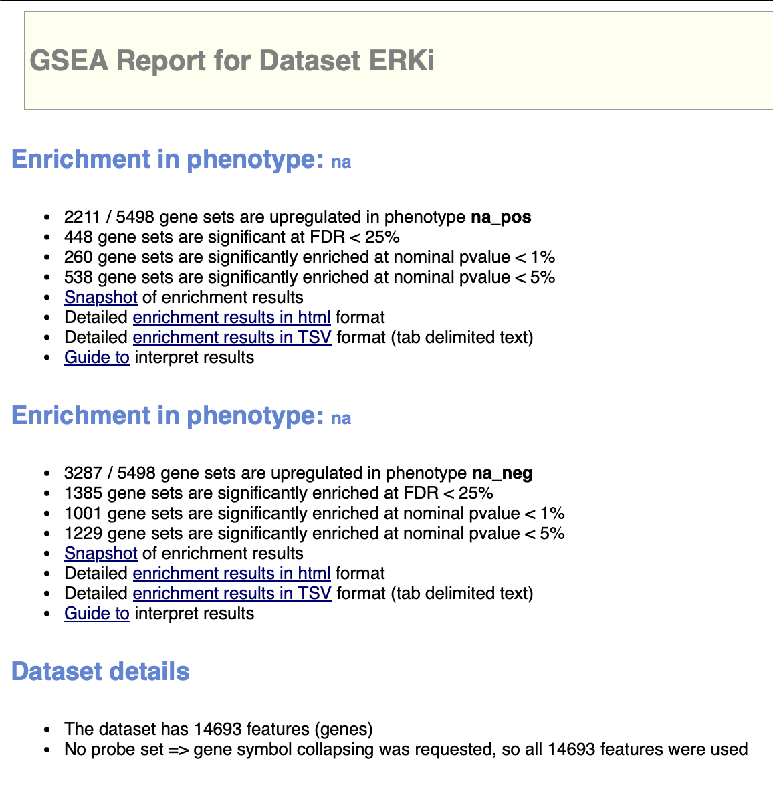
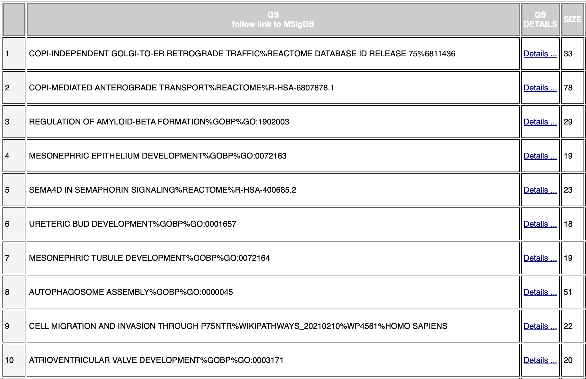
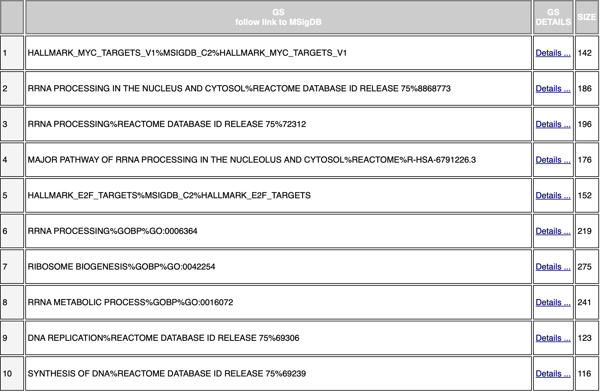
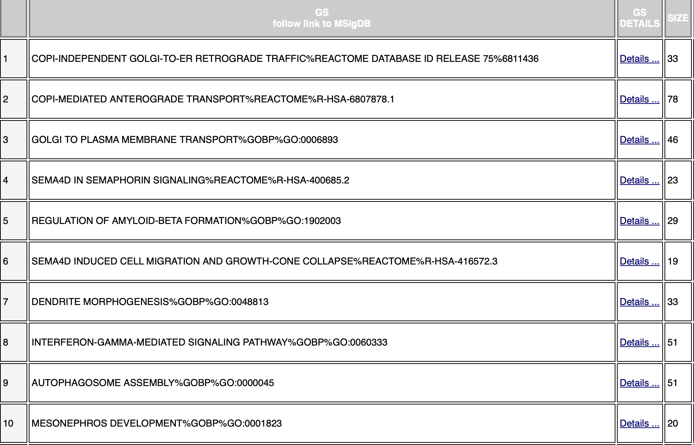
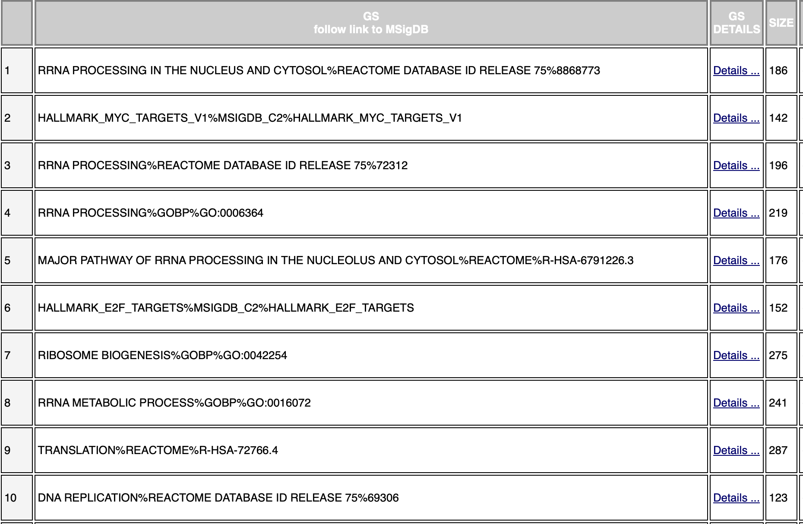
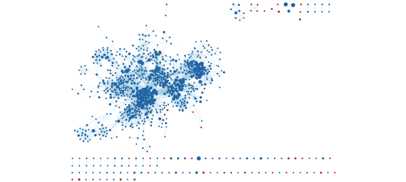
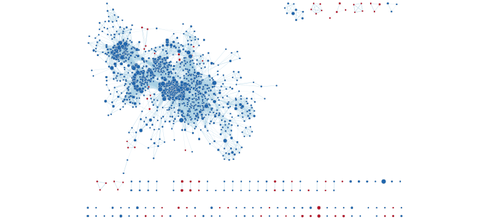
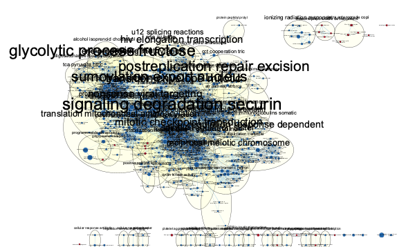
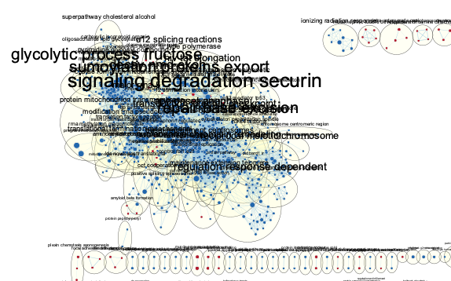
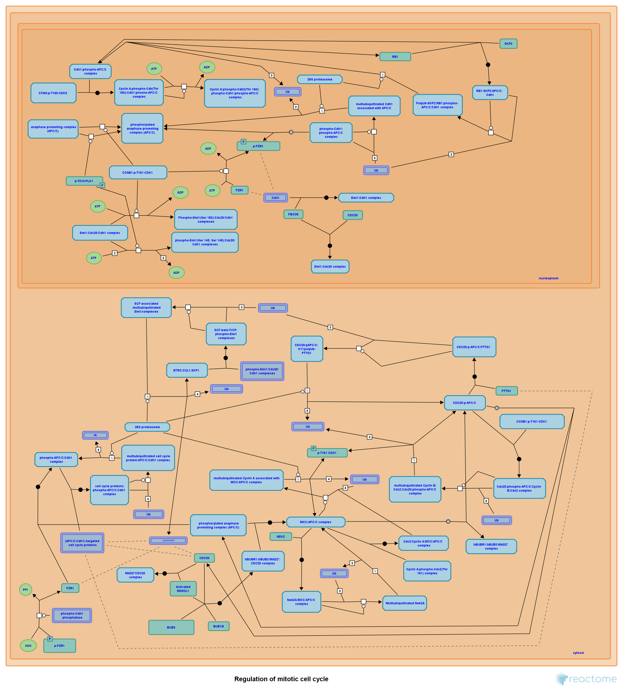

```{r setup, include=FALSE}
knitr::opts_chunk$set(echo = TRUE)
```

## Introduction
This notebook was created by _Koh Zhi Cong Windsor_ using his own made Docker image from Homework Assignment 1. Relevant packages are installed. The dataset’s accession number is GSE228090, and was downloaded from GEO. The gene counts (which are normalised and filtered), as well as the sample information are loaded from Assignment 1's operations.

I then wish to find whether adding MEKi and ERKi causes some genes to be differentially expressed. I do this by performing thresholded gene analysis in Assignment 2. The gmt used is the most recent one as of 6 Mar 2024, e111_eg58_p18_30541362. The thresholds used are from 10 to 500.

```{r, include=FALSE}
# Loading necessary packages

if (! requireNamespace("BiocManager", quietly = TRUE)) {
  install.packages("BiocManager")
}

if (! requireNamespace("Biobase", quietly = TRUE)) {
  BiocManager::install("Biobase")
}

if (!requireNamespace("edgeR", quietly = TRUE)) {
  install.packages("edgeR")
}

library(edgeR)

## load gene information from assignment 2
file_path <- file.path(getwd(), "data", "ERKi_allgenesinfo.txt")
ERKi_allgenes <- read.table(file_path, header = FALSE, sep = "\t", quote = "")
ERKi_allgenes <- ERKi_allgenes[order(ERKi_allgenes[, 2]), ]
colnames(ERKi_allgenes) <- NULL
head(ERKi_allgenes)

## load gene information from assignment 2
file_path <- file.path(getwd(), "data", "MEKi_allgenesinfo.txt")
MEKi_allgenes <- read.table(file_path, header = FALSE, sep = "\t", quote = "")
MEKi_allgenes <- MEKi_allgenes[order(MEKi_allgenes[, 2]), ]
colnames(MEKi_allgenes) <- NULL
head(MEKi_allgenes)
```
I save these as .rnk files for GSEA analysis using GSEAPrerank. This was performed using Human_GOBP_AllPathways_no_GO_iea_April_02_2023_symbol.gmt as the gmt file, and with 2000 permutations.
```{r}
write.table(ERKi_allgenes, file = "ERKi.rnk", sep = "\t", row.names = FALSE)
write.table(MEKi_allgenes, file = "MEKi.rnk", sep = "\t", row.names = FALSE)
```
The results of the analysis from GSEA are shown below.



These show that about 2000 genesets out of about 5500 were enriched with up-regulated genes, and about 3000 with down-regulated genes. These are about the same as in Assignment 2 in terms of numbers.

The top 10 upregulated and downregulated gene sets for ERKi and MEKi are shown below as well.


The genesets largely correlate to important biological processes like RNA processing or transport. This agrees with the paper. 


The genesets, just like for ERKi, also largely correlate to important biological processes like RNA processing or transport. In fact, the top few genesets are actually similar. Comparing to Assignment 2, some of these are actually different, but there are some similarities as well. It is difficult to gauge visually whether they are statistically similar or not. These are similar to the general themes in the paper, which is how it affects kinases which affect the cell cycle.

## Enrichment Analysis
Cytoscape 3.10.2, EnrichmentMap 3.3.6 was used for the network formation. These are the parameters used; one for ERKi and one for MEKi:

analysis type: GSEA

enrichments pos: my_analysis.GseaPreranked.1711507004463/gsea_report_for_na_pos_1711507004463.tsv

enrichments neg: my_analysis.GseaPreranked.1711507004463/gsea_report_for_na_neg_1711507004463.tsv

gmt: Human_GOBP_AllPathways_no_GO_iea_March_01_2021_symbol.gmt

ranks: my_analysis.GseaPreranked.1711507004463/ranked_gene_list_na_pos_versus_na_neg_1711507004463.tsv

expressions: ERKi.rnk

FDR: 0.9


Performing Network Analysis reveals there are a total number of 1298 nodes, and 25695 number of edges.

analysis type: GSEA

enrichments pos: my_analysis.GseaPreranked.1711508381892/gsea_report_for_na_pos_1711508381892.tsv

enrichments neg: my_analysis.GseaPreranked.1711508381892/gsea_report_for_na_neg_1711508381892.tsv

gmt: Human_GOBP_AllPathways_no_GO_iea_March_01_2021_symbol.gmt

ranks: my_analysis.GseaPreranked.1711508381892/ranked_gene_list_na_pos_versus_na_neg_1711508381892.tsv

expressions: MEKi.rnk

FDR: 0.9


Performing Network Analysis reveals there are a total number of 1298 nodes, and 25695 number of edges as well.

The results are similar for both, it is one major connected graph comprising many nodes, while the rest are either isolated or belonging in small connected graphs. 

Annotation was performed using AutoAnnotate 1.4.1, an app obtained from the AppStore. Default settings were used to construct the annotated networks for both networks. These settings are:

Cluster Algorithm: MCL Cluster

Edge Weight Column: None

Label Column: GS_DESCR

Label Algorithm: WordCloud: Adjacent Words (default)

Max words per label: 3

Minimum word occurrence: 1

Adjacent word bonus: 8





For ERKi, the top annotated themes are:

signaling degradation securin	146	

glycolytic process fructose	96	

sumoylation proteins export	90	

For MEKi, the top annotated themes are:

signaling degradation securin	150

glycolytic process fructose	96

repair base excision	93

### Analysis
These themes are similar across both. These pathways agree with the ones in the paper, which mentions that the kinases are usually involved in cell cycle progression, cytoskeletal structure, and cellular differentiation. Securin for instance, inhibits separase, which cleaves the cohesin rings holding chromosomes together, which is an important process in the cell cycle [@Fabregat_Sidiropoulos_Viteri_Marin-Garcia_Ping_Stein_DEustachio_Hermjakob_2018]. The glycolytic process is necessary for cells to function and replicate [@Chandel_2021]. The repair base excision is important in cell cycle checking [@Krokan_Bjoras_2013], and sumolyation is important in regulating various aspects of protein function, such as transcription, sub-cellular localization, DNA repair and cell cycle [@Maejima_Sadoshima_2014]. The pathways thus agree generally with the ones mentioned in the paper.

I choose the top result, the signaling degradation securin for further analysis, because it is present in both ERKi and MEKi, and present in the most nodes. The result, APC C:CDC20 MEDIATED DEGRADATION OF SECURIN%REACTOME%R-HSA-174154.2, consists of 68 proteins, and has a NES of -2.1079 and ES of -0.722 for ERKi. This is a pathway found in Reactome, with the following description: The separation of sister chromatids in anaphase requires the destruction of the anaphase inhibitor, securin. Securin associates with and inactivates the protease, separase. Separase cleaves the cohesin subunit, Scc1 that is responsible for the cohesion of sister chromatids. Securin destruction begins at metaphase after the mitotic spindle checkpoint has been satisfied [@Fabregat_Sidiropoulos_Viteri_Marin-Garcia_Ping_Stein_DEustachio_Hermjakob_2018].

It has the following pathway. Interestingly, a key protein CDC20 as shown in the pathway, which is an important member of the cell cycle, is not mentioned in the paper. However, a similar class protein of CDC25, which is also important in cell cycle regulation, is mentioned in the original paper [@Boutros_Lobjois_Ducommun_2007]. This reveals a lot of proteins are involved in the cell cycle regulation, that original pathways may not sufficiently reveal.


## References

